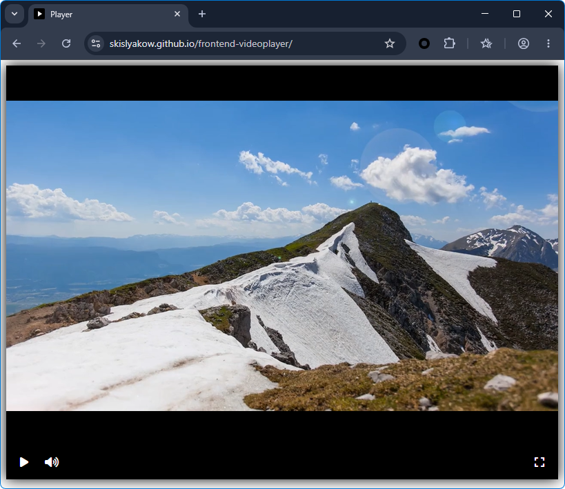

# Videoplayer

A custom video player built with [Playable.js](https://playable.io/).

A ready-to-use component that can be embedded into any HTML page. jQuery, FontAwesome and Playable.js are loaded via CDN — no server-side setup required.

**Live demo:** [skislyakow.github.io/frontend-videoplayer](https://skislyakow.github.io/frontend-videoplayer/)



## Files

| File | Description |
|---|---|
| `player.js` | Player logic (`createPlayer` function) |
| `player.css` | Player styles |
| `index.html` | Demo page with the player |

## How to use

### 1. Copy the HTML markup

```html
<div id="player" class="player-container">
  <div class="js-video-container video-wrapper"></div>
  <div class="controls">
    <div class="button-group">
      <button class="control-button js-play-button">
         <span class="fa fa-play"></span>
      </button>
      <button class="control-button js-pause-button">
        <span class="fa fa-pause"></span>
      </button>
      <button class="control-button js-volume-button" hidden>
        <span class="fa fa-volume-off"></span>
      </button>
      <button class="control-button js-mute-button">
        <span class="fa fa-volume-up"></span>
      </button>
      <div class="spacer"></div>
      <button class="control-button js-fullscreen-button">
        <span class="fa fa-expand"></span>
      </button>
    </div>
  </div>
</div>
```

### 2. Add dependencies and styles in `<head>`

```html
<link rel="stylesheet" href="https://cdn.jsdelivr.net/npm/@fortawesome/fontawesome-free@6.6.0/css/all.min.css">
<link rel="stylesheet" href="player.css">
```

### 3. Add scripts before closing `</body>`

```html
<script src="https://code.jquery.com/jquery-3.4.1.min.js"></script>
<script src="https://unpkg.com/playable@2.10.3/dist/statics/playable.bundle.min.js"></script>
<script src="player.js"></script>
```

### 4. Initialize the player

```html
<script>
  createPlayer({elementId: 'player'});
</script>
```

## `createPlayer` options

| Option      | Type   | Default      | Description                      |
|-------------|--------|--------------|----------------------------------|
| `elementId` | string | —            | Player container ID (required)   |
| `src`       | string | *demo video* | Video file URL                   |

### Example with custom video

```javascript
createPlayer({
  elementId: 'player',
  src: 'https://example.com/video.mp4'
});
```

## Minimal page example

```html
<!DOCTYPE html>
<html>
<head>
  <meta charset="utf-8">
  <title>My Player</title>
  <link rel="stylesheet" href="https://cdn.jsdelivr.net/npm/@fortawesome/fontawesome-free@6.6.0/css/all.min.css">
  <link rel="stylesheet" href="player.css">
</head>
<body>
  <div id="player" class="player-container">
    <div class="js-video-container video-wrapper"></div>
    <div class="controls">
      <div class="button-group">
        <button class="control-button js-play-button">
           <span class="fa fa-play"></span>
        </button>
        <button class="control-button js-pause-button">
          <span class="fa fa-pause"></span>
        </button>
        <button class="control-button js-volume-button" hidden>
          <span class="fa fa-volume-off"></span>
        </button>
        <button class="control-button js-mute-button">
          <span class="fa fa-volume-up"></span>
        </button>
        <div class="spacer"></div>
        <button class="control-button js-fullscreen-button">
          <span class="fa fa-expand"></span>
        </button>
      </div>
    </div>
  </div>

  <script src="https://code.jquery.com/jquery-3.4.1.min.js"></script>
  <script src="https://unpkg.com/playable@2.10.3/dist/statics/playable.bundle.min.js"></script>
  <script src="player.js"></script>
  <script>
    createPlayer({elementId: 'player'});
  </script>
</body>
</html>
```

## Compatibility

- **jQuery** 3.4.1 (CDN)
- **Playable.js** 2.10.3 (CDN)
- **FontAwesome** 6.6.0 (CDN)
- All modern browsers

## Development

Just open `index.html` in your browser — no server required.

Or use any static server, for example:

```bash
npx serve .
```
