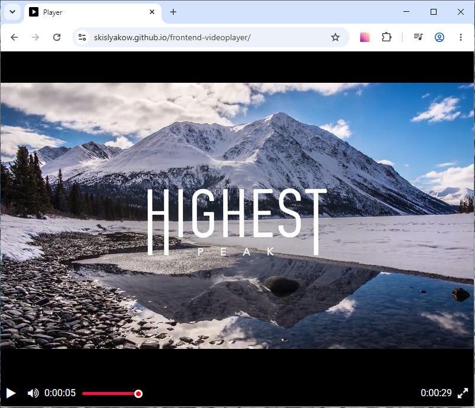

# Videoplayer

Кастомный видеоплеер на [Playable.js](https://playable.io/).

Это готовый компонент, который можно встроить в любую HTML-страницу. jQuery, FontAwesome, Normalize.css и Playable.js подключаются через CDN — серверная часть не нужна.

**Живое демо:** [skislyakow.github.io/frontend-videoplayer](https://skislyakow.github.io/frontend-videoplayer/)



## Файлы

| Файл | Назначение |
|---|---|
| `player.js` | Логика плеера (функция `createPlayer`) |
| `player.css` | Стили плеера |
| `index.html` | Демо-страница с подключением плеера |

## Как использовать

### 1. Скопируйте HTML-разметку

```html
<div id="player" class="player-container">
  <div class="js-video-container video-wrapper"></div>
  <div class="controls">
    <div class="button-group">
      <button class="control-button js-play-button">
         <span class="fa fa-play"></span>
      </button>
      <button class="control-button js-pause-button">
        <span class="fa fa-pause"></span>
      </button>
      <button class="control-button js-volume-button" hidden>
        <span class="fa fa-volume-off"></span>
      </button>
      <button class="control-button js-mute-button">
        <span class="fa fa-volume-up"></span>
      </button>
      <span class="time-label js-current-time">00:00:00</span>
      <div class="js-progress progress-bar">
        <div class="js-progress-slider progress-slider"></div>
        <div class="js-progress-thumb progress-thumb"></div>
      </div>
      <span class="time-label js-duration">00:00:00</span>
      <button class="control-button js-fullscreen-button">
        <span class="fa fa-expand"></span>
      </button>
    </div>
  </div>
</div>
```

### 2. Подключите зависимости и стили в `<head>`

```html
<link rel="preconnect" href="https://fonts.googleapis.com">
<link rel="preconnect" href="https://fonts.gstatic.com" crossorigin>
<link href="https://fonts.googleapis.com/css2?family=Roboto:wght@400&display=swap" rel="stylesheet">
<link rel="stylesheet" href="https://cdnjs.cloudflare.com/ajax/libs/font-awesome/4.7.0/css/font-awesome.min.css">
<link rel="stylesheet" href="https://cdnjs.cloudflare.com/ajax/libs/normalize/8.0.1/normalize.min.css">
<link rel="stylesheet" href="player.css">
```

### 3. Подключите скрипты перед закрывающим `</body>`

```html
<script src="https://code.jquery.com/jquery-3.4.1.min.js"></script>
<script src="https://unpkg.com/playable@2.10.3/dist/statics/playable.bundle.min.js"></script>
<script src="player.js"></script>
```

### 4. Проинициализируйте плеер

```html
<script>
  createPlayer({elementId: 'player'});
</script>
```

## Параметры `createPlayer`

| Параметр   | Тип    | По умолчанию | Описание                     |
|------------|--------|--------------|------------------------------|
| `elementId`| string | —            | ID контейнера плеера (обязательно) |
| `src`      | string | *демо-видео*  | URL видеофайла               |

### Пример со своим видео

```javascript
createPlayer({
  elementId: 'player',
  src: 'https://example.com/video.mp4'
});
```

## Минимальная страница

```html
<!DOCTYPE html>
<html>
<head>
  <meta charset="utf-8">
  <title>Мой плеер</title>
  <link rel="preconnect" href="https://fonts.googleapis.com">
  <link rel="preconnect" href="https://fonts.gstatic.com" crossorigin>
  <link href="https://fonts.googleapis.com/css2?family=Roboto:wght@400&display=swap" rel="stylesheet">
  <link rel="stylesheet" href="https://cdnjs.cloudflare.com/ajax/libs/font-awesome/4.7.0/css/font-awesome.min.css">
  <link rel="stylesheet" href="https://cdnjs.cloudflare.com/ajax/libs/normalize/8.0.1/normalize.min.css">
  <link rel="stylesheet" href="player.css">
</head>
<body>
  <div id="player" class="player-container">
    <div class="js-video-container video-wrapper"></div>
    <div class="controls">
      <div class="button-group">
        <button class="control-button js-play-button">
           <span class="fa fa-play"></span>
        </button>
        <button class="control-button js-pause-button">
          <span class="fa fa-pause"></span>
        </button>
        <button class="control-button js-volume-button" hidden>
          <span class="fa fa-volume-off"></span>
        </button>
        <button class="control-button js-mute-button">
          <span class="fa fa-volume-up"></span>
        </button>
        <span class="time-label js-current-time">00:00:00</span>
        <div class="js-progress progress-bar">
          <div class="js-progress-slider progress-slider"></div>
          <div class="js-progress-thumb progress-thumb"></div>
        </div>
        <span class="time-label js-duration">00:00:00</span>
        <button class="control-button js-fullscreen-button">
          <span class="fa fa-expand"></span>
        </button>
      </div>
    </div>
  </div>

  <script src="https://code.jquery.com/jquery-3.4.1.min.js"></script>
  <script src="https://unpkg.com/playable@2.10.3/dist/statics/playable.bundle.min.js"></script>
  <script src="player.js"></script>
  <script>
    createPlayer({elementId: 'player'});
  </script>
</body>
</html>
```

## Совместимость

- **jQuery** 3.4.1 (CDN)
- **Playable.js** 2.10.3 (CDN)
- **FontAwesome** 4.7.0 (CDN)
- **Normalize.css** 8.0.1 (CDN)
- **Roboto** (Google Fonts)
- Все современные браузеры

## Разработка

Просто откройте `index.html` в браузере — никакой сервер не нужен.

Либо используйте любой статический сервер, например:

```bash
npx serve .
```
